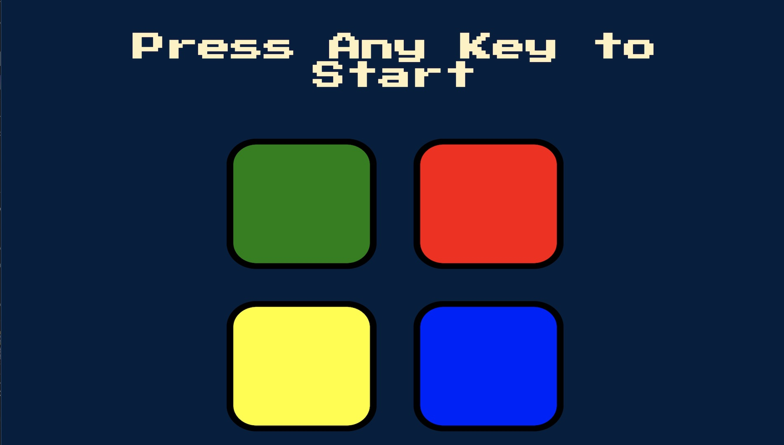

<h1 align="center"> Simon Game</h1>

<p align="center">  
A web version of the popular electronic memory skill game. The application creates a sequence sounds and lights and requires to the user to repeat the sequence. 
Built using jQuery to simplify the applications DOM tree traversal and event handling.
</p>

<div>
  
</div>

## Built with
- HTML5 & CSS3
- JavaScript
- jQuery


## Get started

From your command line, first clone this repo:

```bash
# Clone this repository
$ git clone https://github.com/tagabaza/Simon_Game

# Go into the repository
$ cd Simon_Game

# Remove current origin repository
$ git remote remove origin
```

Then you can install the dependencies using NPM:

Using NPM:

```bash
# Install dependencies
$ npm install
```
